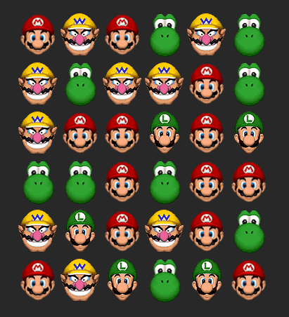
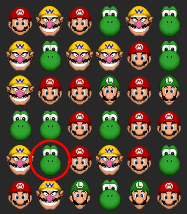
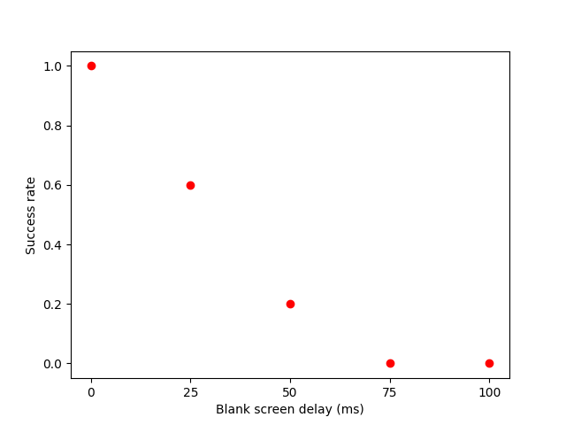

# change-blindness

We made a small script to run an experiment related to change blindness, based on the article [Change Blindness](https://www.sciencedirect.com/science/article/pii/S1364661397010802) by Daniel J. Simons, Daniel T. Levin.

[Github Repo](https://github.com/k-yoshi-tosti/change-blindness)

# Background

Change blindness is defined as "the inability to detect changes to an object or scene". This phenomena is quite interesting, as it allows us to understand how the brain extracts an accurate high-level structure from the underlying visual information (which changes a few times per second, with the eyes movements).

Numerous experiments from the article have shown that we actually perceive the world in way less detail than what we think. Indeed, we can generally notice a change on a static image immediately (it "catches the eye"); however, as soon as the change occurs during an eye movement or after the object of attention is hidden for a short time, seeing the change becomes much harder.

For exemple, a study showed participants text in alternative case (sUcH aS tHiS), and entirely switched the case at every eye movement; even when the participants are actively reading, they usually did not notice the change. Likewise, participants asked to reorder boxes on a screen to copy a model did not notice changes to the model when they were not looking at it, even though it was at the center of their attention.

One of the criticism to these approaches is that they are usually taking place on screen, and thus show much less visual details that real-world interactions. To test this, the authors have tried making participants talk to an experimenter, and during the interaction two persons walk between the two conversers holding a door, which temporarily separates the conversers; then, the experimenter secretly swaps with one of the persons holding the door. Surprisingly enough, almost half of the time, the subject did not notice they were talking to a different person! See the [video](https://youtu.be/VkrrVozZR2c?si=c4ATV2Ax2akPNIaB&t=112).

# Our experiment

We try to test this phenomena, using the flickering approach.

A grid of characters is shown for a few seconds, then the screen becomes blank for a certain duration (sometimes 0), then a single character changes. The user has to click on the character which changed.

Before flickering                   |  After flickering
:----------------------------------:|:-------------------------:
 | 

The red circle is only shown if the user fails to click on the correct character.

Usually, we are always able to see the change when there is no flicker between the two grids. However, even a very short blank delay (as small as 50 milliseconds) can entirely wipe out our short-term visual memory and make us unable to detect the change.

When all trials are done, results are stored as a csv file and then shown using matplotlib. You can also show results from a previous experiment, see Usage below.

Below are sample results for the experiment. Usually, there is a clear decrease between 100% success rate when there is no flickering, and 0 or near-0 success rate for 100ms delay.

# Usage

Run `python main.py` to launch the main script. At the end of the experiment, the result is saved in a file `data/result{i}.csv` (where i is the smallest integer such that the file does not already exist).

Run `python main.py data/result0.csv` to only show the results without running the experiment again.

Data is saved as a csv file, containing for each iteration `delay success click_delay`.

If needed: `pip install pygame matplotlib`.

You can change the number of trials `N_TRIALS`. The delay times take `NUM_DELAYS` different values between 0 and `MAX_WAIT_DELAY` milliseconds (by default, there are 25 trials, 5 different delay values between 0 and 100 ms).

# Authors

Inès Bichon & Pablo Rey
